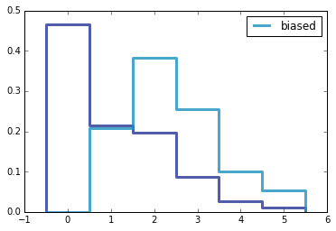

[Think Stats Chapter 3 Exercise 1](http://greenteapress.com/thinkstats2/html/thinkstats2004.html#toc31) (actual vs. biased)

<pre>
<b>Problem</b>
Something like the class size paradox appears if you survey children and ask 
how many children are in their family. Families with many children are more 
likely to appear in your sample, and families with no children have no chance 
to be in the sample.
Use the NSFG respondent variable NUMKDHH to construct the actual distribution
for the number of children under 18 in the household.
Now compute the biased distribution we would see if we surveyed the children
and asked them how many children under 18 (including themselves) are in their 
household.
Plot the actual and biased distributions, and compute their means.

<b>Code </b>
from collections import defaultdict

<i>#Import Data</i>
import chap01soln
resp = chap01soln.ReadFemResp()

<i>#Creating an Unbiased Distribution</i>
unbiased_dist = defaultdict(int)
for value in resp.numkdhh:
    unbiased_dist[value]+=1
    
unbiased_dist = dict(unbiased_dist)

<i>#Creating a Biased Distribution</i>
def to_bias(unbiased_dist):
    bias = unbiased_dist.copy()
    
    for number, frequency in bias.items():
        bias[number] = bias[number] * number
    return bias
    
bias_dist = to_bias(unbiased_dist)

<b>Distribution Results</b>
unbiased_pmf
{0: 3563, 1: 1636, 2: 1500, 3: 666, 4: 196, 5: 82}

bias_dist:
{0: 0, 1: 1636, 2: 3000, 3: 1998, 4: 784, 5: 410}

<b>Means of Distributions</b>
<i>#mean of biased_distributions</i>
sum(to_bias(bias_dist).values())/float(sum(bias_dist.values()))
2.4036791006642821

<i>mean of unbiased distributions</i>
sum(to_bias(unbiased_dist).values())/float(sum(unbiased_dist.values()))
1.0242051550438309

<b>Graph </b>

<b>Intuition </b>
The unbiased distribution of the number of children under 18 in a household has a lower 
mean than the biased one since the households with zero children are ignored in the biased
distributions. You can clearly see this in the graph, where household with no children make 
up most households in the unbiased distributions but none in the biased ones. 

</pre>
