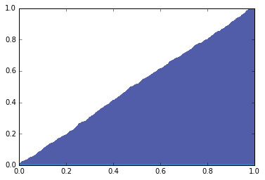

[Think Stats Chapter 4 Exercise 2](http://greenteapress.com/thinkstats2/html/thinkstats2005.html#toc41) (a random distribution)

<pre>
<b>Problem</b>
The numbers generated by random.random are supposed to be uniform between 0 and 1;
that is, every value in the range should have the same probability.
Generate 1000 numbers from random.random and plot their PMF and CDF. 
Is the distribution uniform?

<b>Code </b>
import random

<i>#Create a list of random numbers</i>
random_list = []
for i in range(1000):
    random_list.append(random.random())

<i>#Calculate the distribution functions of the random numbers</i>
random_pmf = thinkstats2.Pmf(random_list)
random_cdf = thinkstats2.Cdf(random_list)

<i>#Plotting</i>
thinkplot.PrePlot(2)
thinkplot.Pmfs([random_cdf, random_pmf])
thinkplot.Show()

<b>Graph</b>

<b>Intuition </b>
The distribution is uniform since in the visualization of the probability 
mass function the likelihood of each point is equal at .1%. This also means
that the slope of the cumulative distribution function close to zero, which 
it is. These two point to the conclusion that the points are indeed random.  
</pre>
